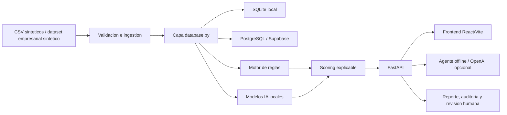

# Arquitectura tecnica

FraudIA Claims es un prototipo web modular para priorizar siniestros que requieren revision humana. La solucion separa claramente frontend, API, persistencia, scoring e inteligencia artificial para que el jurado pueda revisar cada parte sin depender de componentes ocultos.

## Vista general

## Componentes principales

- **Frontend React/Vite**: centro de mando, bandeja, expediente del siniestro, red de relaciones, agente IA, prueba del jurado, Vision, carga CSV, reporte ejecutivo y auditoria.
- **FastAPI**: expone contratos JSON para dashboard, siniestros, score temporal, agente, relaciones, reporte, auditoria, revision humana y analisis visual.
- **Capa de base de datos**: `database.py` abstrae SQLite local y PostgreSQL/Supabase en despliegue. El frontend nunca lee CSV ni credenciales; siempre consume la API.
- **Persistencia**: tablas de asegurados, polizas, siniestros, proveedores, vehiculos, documentos, scores, alertas, metricas, decisiones humanas y logs de auditoria.
- **Scoring**: combina reglas de negocio, anomalias numericas, similitud narrativa y modelo supervisado demo. Cada punto queda trazable en alertas y detalle del caso.
- **Agente IA**: responde con herramientas locales de solo lectura. OpenAI es opcional y tiene fallback offline.

## Flujo tecnico de un siniestro

1. Los datos sinteticos se validan y cargan en SQLite o PostgreSQL.
2. El motor de reglas genera alertas con codigo, descripcion, evidencia y puntaje.
3. Los modelos locales calculan senales complementarias: anomalia, similitud narrativa y probabilidad supervisada demo.
4. `scoring.py` consolida `score_final`, nivel `Verde/Amarillo/Rojo` y accion sugerida.
5. FastAPI sirve los datos al frontend y al agente.
6. El analista revisa el expediente y puede registrar una decision humana sin cambiar el score.
7. Cada consulta sensible, decision o pregunta al agente puede quedar registrada en auditoria.

## Despliegue

- **Local/offline**: SQLite o CSV versionados para que la demo funcione sin internet.
- **Cloud**: Render despliega frontend React y backend FastAPI; PostgreSQL/Supabase se configura por variables de entorno.
- **Secretos**: `.env` no se versiona. `OPENAI_API_KEY` y `FRAUDIA_DATABASE_URL` se leen solo desde variables locales o del panel cloud.

## Decisiones de diseno

- El score no depende del LLM para mantener trazabilidad.
- La IA generativa redacta respuestas, pero no altera datos ni decide pagos.
- Los casos nuevos de la prueba del jurado se calculan temporalmente y no se persisten.
- Vision es auxiliar: analiza imagenes como apoyo, no como peritaje automatico.
- PostgreSQL es la opcion recomendada para disponibilidad 24/7; SQLite queda como fallback reproducible.

## Limitaciones tecnicas

- Los datos son sinteticos; no prueban desempeno real en produccion.
- Las metricas supervisadas usan etiqueta sintetica y sirven solo como evidencia tecnica de funcionamiento.
- Para produccion se requeririan migraciones formales, gobierno de datos, monitoreo de sesgo, control de acceso real y validacion con expertos de siniestros.
