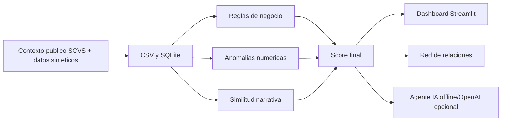

# Arquitectura

FraudIA Claims sigue un flujo reproducible:

## Componentes

- `synthetic_data.py`: genera asegurados, polizas, proveedores, vehiculos, siniestros y documentos.
- `rules.py`: aplica reglas trazables por ramo y reglas criticas.
- `models.py`: usa `IsolationForest` si esta disponible; si no, usa una alternativa robusta por percentiles.
- `nlp.py`: calcula similitud TF-IDF si esta disponible; si no, detecta narrativas clonadas exactas.
- `scoring.py`: combina reglas, anomalias y NLP en el semaforo oficial.
- `agent_tools.py`: expone consultas seguras de solo lectura y scoring temporal.
- `offline_agent.py` y `openai_agent.py`: responden preguntas del jurado.
- `analytics.py`: KPIs ejecutivos, Pareto de proveedores, matrices y concentracion por ciudad.
- `demo.py`: ruta de pitch, preguntas sugeridas y casos destacados.
- `reports.py`: reporte ejecutivo HTML descargable.
- `app/main.py`: orquestador Streamlit.
- `app/pages.py` y `app/components.py`: paginas y componentes visuales reutilizables.

## Decisiones

- SQLite evita infraestructura externa y permite consultas relacionales durante la demo.
- CSV permite inspeccion y regeneracion de datos.
- El LLM queda fuera del calculo del score para mantener trazabilidad.
- Los casos nuevos de la demo se guardan en sesion y no escriben en SQLite.
