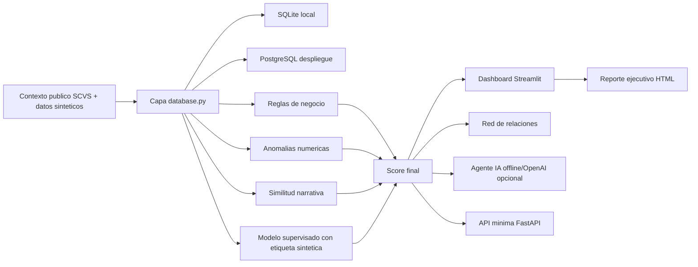

# Arquitectura

FraudIA Claims sigue un flujo reproducible:

## Componentes

- `synthetic_data.py`: genera asegurados, polizas, proveedores, vehiculos, siniestros y documentos.
- `rules.py`: aplica reglas trazables por ramo y reglas criticas.
- `models.py`: usa `IsolationForest` si esta disponible; si no, usa una alternativa robusta por percentiles.
- `models.py`: entrena un modelo supervisado demo con etiqueta sintetica y genera metricas reproducibles.
- `nlp.py`: calcula similitud TF-IDF si esta disponible; si no, detecta narrativas clonadas exactas.
- `scoring.py`: combina reglas, anomalias y NLP en el semaforo oficial.
- `agent_tools.py`: expone consultas seguras de solo lectura y scoring temporal.
- `offline_agent.py` y `openai_agent.py`: responden preguntas del jurado.
- `app/main.py`: orquestador Streamlit liviano.
- `app/pages.py`: paginas de demo guiada, dashboard, bandeja, detalle, caso nuevo, agente y reporte.
- `api.py`: API minima para integracion futura.

## Decisiones

- PostgreSQL es la base recomendada para despliegue y disponibilidad 24/7.
- SQLite queda como fallback local para evitar infraestructura externa durante pruebas rapidas.
- CSV permite inspeccion y regeneracion de datos.
- El LLM queda fuera del calculo del score para mantener trazabilidad.
- Las metricas supervisadas se calculan con etiqueta sintetica; sirven para demo tecnica, no para prometer desempeno real.
- Los casos nuevos evaluados en vivo se guardan solo en sesion y no modifican la base persistida.

## Configuracion de base de datos

Variables principales:

- `FRAUDIA_DB_BACKEND=sqlite|postgres`
- `FRAUDIA_DB_PATH=data/processed/fraudia_claims.db`
- `FRAUDIA_DATABASE_URL=postgresql+psycopg://...`

En demo local el default es SQLite. En despliegue se recomienda PostgreSQL administrado en Render, Supabase o Railway con secretos configurados desde la plataforma.
