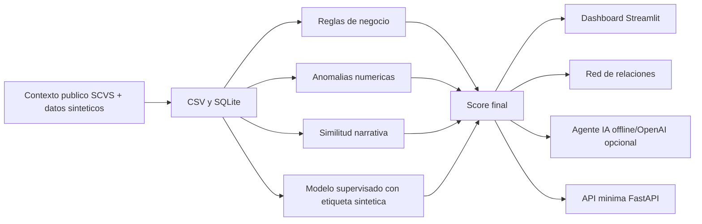

# Arquitectura

FraudIA Claims sigue un flujo reproducible:

## Componentes

- `synthetic_data.py`: genera asegurados, polizas, proveedores, vehiculos, siniestros y documentos.
- `rules.py`: aplica reglas trazables por ramo y reglas criticas.
- `models.py`: usa `IsolationForest` si esta disponible; si no, usa una alternativa robusta por percentiles.
- `models.py`: entrena un modelo supervisado demo con etiqueta sintetica y genera metricas reproducibles.
- `nlp.py`: calcula similitud TF-IDF si esta disponible; si no, detecta narrativas clonadas exactas.
- `scoring.py`: combina reglas, anomalias y NLP en el semaforo oficial.
- `agent_tools.py`: expone consultas seguras de solo lectura y scoring temporal.
- `offline_agent.py` y `openai_agent.py`: responden preguntas del jurado.
- `app/main.py`: interfaz Streamlit para demo.
- `api.py`: API minima para integracion futura.

## Decisiones

- SQLite evita infraestructura externa y permite consultas relacionales durante la demo.
- CSV permite inspeccion y regeneracion de datos.
- El LLM queda fuera del calculo del score para mantener trazabilidad.
- Las metricas supervisadas se calculan con etiqueta sintetica; sirven para demo tecnica, no para prometer desempeno real.
